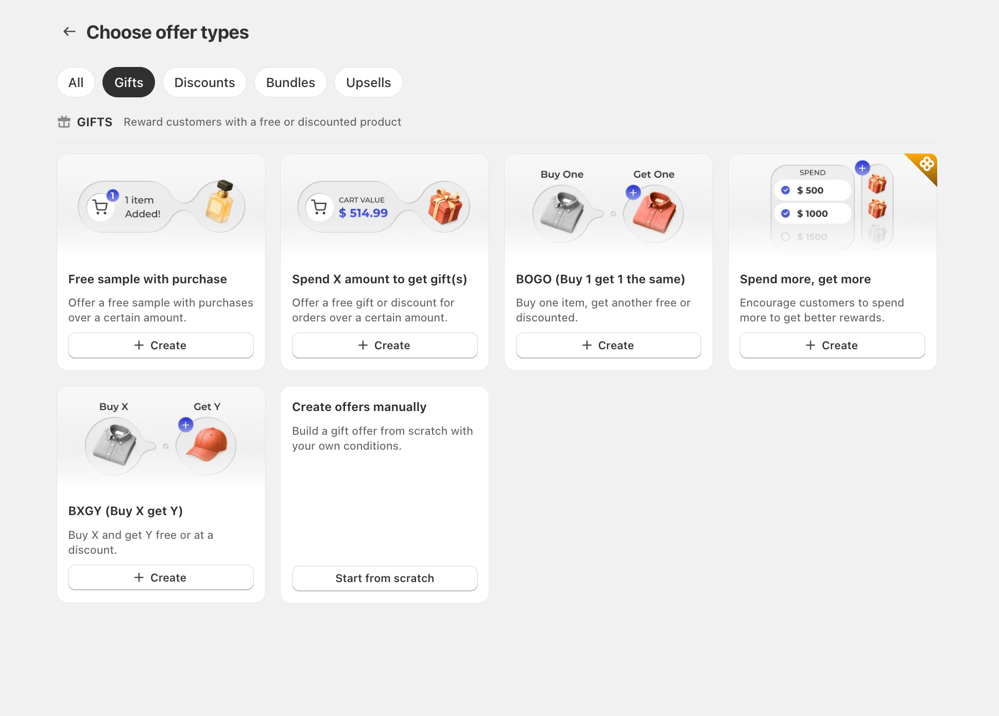

# BOGOS Funktionsübersicht

BOGOS unterstützt mehrere Angebotstypen und hilft Ihnen, Werbekampagnen in Ihrem Shop zu erstellen, zu verwalten und zu optimieren.

Diese Seite beschreibt die wichtigsten Funktionen von BOGOS.



## 1. Verfügbare Angebotstypen

### a) Geschenkangebote

Geschenkangebote helfen Ihnen, **Ihre Kunden mit Geschenken zu belohnen**, basierend auf Bedingungen wie Warenkorbwert, Menge oder ausgewählten Artikeln. Sie fördern größere Käufe und stärken die Markenwahrnehmung.

Sie können **Geschenke automatisch zum Warenkorb hinzufügen** oder **Kunden ihr Geschenk in einem Pop-up auswählen lassen**.

**Zu den Geschenkangebotstypen gehören:**

<figure><figcaption></figcaption></figure>

**Zu den Rabattoptionen gehören:**

* Prozentrabatt
* Betragsrabatt
* Versandrabatt (als Geschenk)

Für die detaillierte Einrichtung besuchen Sie die Anleitung \[[Geschenkangebot](../detailed-guide/gift-offer/)].

### b) Bundle-Angebote

Mit Bundle-Angeboten können Sie feste Pakete erstellen oder Kunden ihre eigenen Kombinationen mit flexiblen Rabattoptionen zusammenstellen lassen. Dies hilft Kunden, **auf natürliche Weise weitere ergänzende Produkte zu entdecken und mehr zu kaufen.**

**Zu den Bundle-Angebotstypen gehören:**

<figure><figcaption></figcaption></figure>

**Zu den Rabattoptionen gehören:**

* Prozentsatz
* Betrag
* Festpreis
* Kostenloses Produkt
* Versandrabatt
* Gestaffelter Rabatt (außer beim klassischen Bundle)

Für die detaillierte Einrichtung besuchen Sie die Anleitung \[[Bundle-Angebot](../detailed-guide/bundle-offer/)].

### c) Upsell-Angebote

Upsell-Angebote helfen Ihnen, **relevante Zusatzempfehlungen** mit unterschiedlichen Rabattarten anzuzeigen, um den Warenkorbwert zu erhöhen. Sie können Upsell-Produkte manuell auswählen oder sie automatisch oder zufällig von BOGOS vorschlagen lassen.

**Zu den Upsell-Angebotstypen gehören:**

<figure><figcaption></figcaption></figure>

**Zu den Rabattoptionen gehören:**

* Prozentsatz
* Betrag
* Günstigster Artikel kostenlos

Für die detaillierte Einrichtung besuchen Sie die Anleitung \[[Upsell-Angebot](../detailed-guide/upsell-offer/)].

### d) Rabattangebote

Rabattangebote wenden mengenbasierte Rabatte an, die Kunden dafür belohnen, mehr zu kaufen. Sie können mehrere Stufen festlegen, um noch größere Bestellungen zu fördern.

**Zu den Rabattangebotstypen gehören:**

<figure><figcaption></figcaption></figure>

**Zu den Rabattoptionen gehören:**

* Prozentsatz
* Betrag
* Festpreis
* Versandrabatt

Für die detaillierte Einrichtung besuchen Sie die Anleitung \[[Rabattangebot](../detailed-guide/discount-offer/)].

## 2. Werbetools

Mit BOGOS können Sie Angebote mit vielen Tools in Ihrem gesamten Shop präsentieren und bewerben.

**Leistungsstarke Booster**, die dabei helfen, Aktionen hervorzuheben und Kunden zum Kaufabschluss zu motivieren:

* Fortschrittsanzeige
* Heute-Angebot-Widget
* Heute-Angebot-Block
* Angebotsseite

Für die detaillierte Einrichtung besuchen Sie die Anleitung \[[Booster]](../detailed-guide/boosters/).

**Die Angebots-Widgets** helfen Ihnen, das Angebot überall anzuzeigen, wo Sie möchten. Diese Widgets ermöglichen es Ihnen außerdem, alles anzupassen, von Text und Farben bis zur Anzeige. Dazu gehören:

* Geschenkangebot-Widget: Geschenk-Schieberegler, Warenkorbnachricht, Symbol & Geschenk-Thumbnail
* Klassisches-Bundle-Widget
* Mischen-und-kombinieren-Widget
* Bundle-Seiten-Widget
* Häufig-zusammen-gekauft-Widget
* Checkout-Upsell-Widget
* Danke-Seite-Upsell-Widget
* Mengenrabatt- oder Staffelpreis-Widget
* Rabatt auf den günstigsten/teuersten Artikel-Widget

Für die detaillierte Einrichtung besuchen Sie die Anleitung \[[Anpassen](../detailed-guide/customize/)].

## 3. Angebotsverwaltung

BOGOS bietet Tools, um Angebote in Ihrem Shop **effizient zu starten, zu verwalten und zu skalieren**:

* Legen Sie [Prioritätsregeln](../detailed-guide/gift-offer/create-gift-offer.md#id-5.1.-works-with-other-offers) fest, um Überschneidungen von Angeboten zu vermeiden
* Kombinieren Sie Angebote mit anderen Rabatten
* Bearbeiten Sie Angebote in großen Mengen für eine einfachere Verwaltung
* Importieren und exportieren Sie Angebote, um sie über mehrere Shops hinweg zu synchronisieren

## 4. Analytik

Verfolgen Sie, was funktioniert, mit **Echtzeit-Trenddiagrammen**, die die Leistung im Zeitverlauf visualisieren, sowie detaillierten Konversionskennzahlen für jedes Angebot.

Sie können auch **Analysedaten exportieren** für eine tiefergehende Analyse in Ihren bevorzugten externen Tools.

Für detaillierte Informationen besuchen Sie die Anleitung \[[Analytik](../detailed-guide/analytics/)].

## 5. Übersetzung

BOGOS hilft Ihnen, Ihre Aktionen für Kunden in jedem Markt mit flexiblen Übersetzungsoptionen zu lokalisieren:

* Integrierte automatische und manuelle Übersetzungsoptionen innerhalb der App
* Integration mit Drittanbieter-Übersetzungs-Apps für nahtlose Synchronisierung (Transcy, Weglot, …)

Für detaillierte Informationen besuchen Sie die Anleitung \[[Übersetzung](../detailed-guide/translation.md)].

## 6. Integrationen

BOGOS synchronisiert nahtlos mit mehreren Verkaufskanälen und Drittanbieter-Integrationen, damit Ihre Kampagnen überall dort reibungslos laufen, wo Kunden interagieren, ohne mit Ihren Shop-Einstellungen zu kollidieren:

**Unterstützte Verkaufskanäle:**

* Shopify Online-Shop
* Shopify POS
* Headless-/Hydrogen-Shops
* Mobile Apps: Onemobile

**Storefront- und Theme-Kompatibilität:**

* Fast alle Shopify-Themes
* Mit Page-Buildern erstellte Shops: PageFly, GemPages, EComposer, Foxify, …

**Drittanbieter-Integrationen:**

* Warenkorb-Drawer-Apps: iCart, …
* Übersetzungs-Apps: Transcy, Weglot, LangWILL, Langify, …
* Bewertungs-Apps: Judge.me, TrusWILL, …
* Abonnement-Apps: Appstle, Recurpay, …
* Weitere Shopify-Drittanbieter-Tools

Für detaillierte Integrationsinformationen besuchen Sie die Anleitung \[[Integration](https://app.gitbook.com/s/NQLNoTm29nYTk7OOG6Lu/integration)].

## 7. KI-Assistent

BOGOS enthält einen KI-Assistenten, der Ihre Werbeideen sofort in einsatzbereite Angebote umwandelt und Sie dabei durch alle Fragen führt, die Sie zur App haben.

Für detaillierte Informationen besuchen Sie die Anleitung \[[KI-Assistent](../detailed-guide/ai-features/)].
