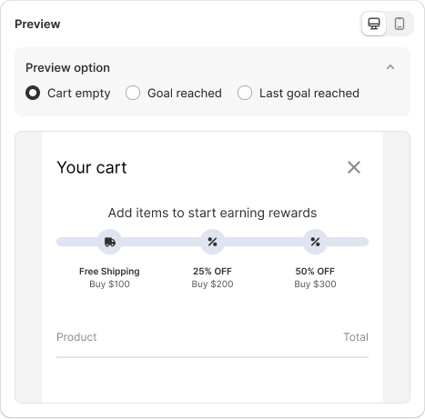
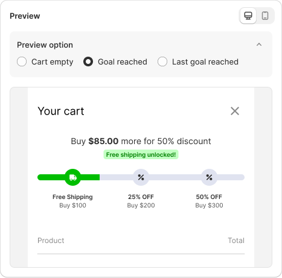

# Create Progress bar

Learn how to create a Progress Bar to let customers know about the offers and motivate them to purchase more to meet the requirements.

<figure><figcaption></figcaption></figure>



Start with our guide on creating a **Progress Bar** from scratch.

### 1. General

<figure><figcaption></figcaption></figure>

**Bar name:** The internal name of the bar for management.

**Bar title**: The bar title displayed to customers in your store.

**Start time**: The date and time when the progress bar begins

**End time**: The date and time when the progress bar ends.

**Count progress by**: Choose how you want to track progress bar&#x20;

* **Cart value**: Progress will be based on the total value of items in the cart.
* **Cart quantity**: Progress will be based on the total quantity of items in the cart.

**Filter conditions**: Set conditions to decide which products, locations, or customer tags the progress bar will appear on and track.

You can choose from three main conditions: **Product**, **Location**, or **Customer tags**.

▶ **Product:** Choose specific products that will count toward the cart value or cart quantity you set above.

* **All except selected products**: Applies to all products except the specific products you select.
* **All except selected types/vendors/collections**: Applies to everything except the types, vendors, or collections you select.
* **Selected products**: Applies only to the chosen products.
* **Products in selected types/vendors/collections**: Applies only to products within the chosen types, vendors, or collections.


If you don’t enable this option, the progress bar will apply to all available items in your store.


▶ **Location:** Choose locations to display the progress bar. You can select multiple countries at once.&#x20;

<figure><figcaption></figcaption></figure>

* **Exclude customers from selected locations**: Allows you to prevent the booster from applying to customers in the chosen countries.

▶ **Customer tags:** Show or hide the progress bar based on customer tags.

* **Select tags:** Choose one or more customer tags. Customers with any of the selected tags will see the progress bar.
* **Exclude customers with these tags:** Enable this to hide the progress bar from customers who have any of the selected tags.
* **Consider no-login as a customer with no tags:** Enable this to treat non-logged-in visitors as customers without tags, so they are excluded from tag-based targeting.

### **2. Goal**

There are **two options** for you to choose from.

**Multiple Goals**&#x20;

<figure><figcaption></figcaption></figure>

**Single Goal**

<figure><figcaption></figcaption></figure>

#### 2.1. Goal set up

This section allows you to set up the key details for your progress bar.

* **Value:** Enter the target value for the goal.
* **Goal title:** This is the name of the goal.
* **Goal description:** A description to explain the goal to customers.
* **Select goal icon:** Choose an icon that represents your goal from four pre-set icons or upload your own icon from your computer.
* **Countdown message:** Add a message that shows how much more the customer needs to spend to unlock the goal.
* **Success label:** Set a success message to celebrate when the customer reaches the goal.

<figure><figcaption></figcaption></figure>

* **Add goal:** This option is only available if you’re setting up multiple goals — the ‘+’ button lets you add more than one incentive.

### 3. Display

* **Show success label when each goal is unlocked**: Enable this option to display a success message every time a goal is completed by the customer.
* **Show bar title:** Enable this option if you want to display a title at the top of the progress bar.
* **Show start message:** Display a custom message at the beginning of the progress bar to let customers know about the rewards they can earn.
* **Show message if all goals are unlocked:** Customize the final message that appears once all goals have been completed.
* **Icon size:** Choose the size of the icon displayed on the progress bar.
* **Bar height:** Choose the height of the progress bar from two options

**Fixed height bar**: The height remains the same regardless of the content.\
**Wrap icon:** The height adjusts based on the size of the icon.

<figure><figcaption></figcaption></figure>

### **4. Color customization**

This section allows you to adjust the visual theme of your offer to match your store’s branding.

* **Choose a Theme:** Select a pre-designed color theme to apply to your offer.&#x20;

You can further personalize it by adjusting the colors of the following elements.

* **Bar Color:** Active bar, Empty bar.
* **Text Color:** Goal title, Goal description, Success background color, Success label text, Message color.
* **Background and Border Color:** Background color, Border color.

### **5. Preview option**

This section lets you preview the progress bar at each stage of the journey, from the cart being empty to reaching the final goal.

* **Cart empty:** Displays the rewards available when the cart is empty.

<figure><figcaption></figcaption></figure>

* **Goal reached**: Shows the progress and rewards once the customer has met the conditions.

<figure><figcaption></figcaption></figure>

* **Last goal reached:** Displays the final goal reached by the customer in the reward journey.

<figure><figcaption></figcaption></figure>

### 6. Edit Progress Bar on Theme

Some themes may require additional settings to properly display the booster on the store. To adjust this booster’s display settings, click the **Open theme editor** button.

<figure><figcaption></figcaption></figure>

