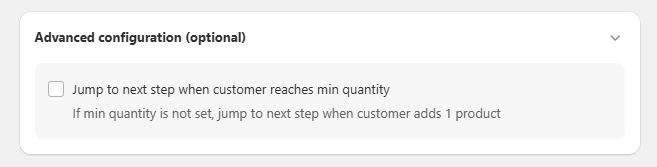

# Bundle-Builder erstellen



Diese Funktion ermöglicht es Shopbetreibern, eine „Stellen Sie Ihr eigenes Bundle zusammen"-Seite zu erstellen, auf der Kunden ein an ihre Bedürfnisse angepasstes Bundle zusammenstellen können. Diese Funktion wurde entwickelt, um das Kundenengagement zu steigern und den durchschnittlichen Bestellwert durch maßgeschneiderte Bündelungsoptionen zu erhöhen.

## 1. Bundle-Informationen

Der Abschnitt **Bundle-Informationen** ermöglicht es Ihnen, die grundlegenden Details Ihres Bundle-Builders zu konfigurieren. Jedes Eingabefeld wird im Folgenden erläutert, damit Sie Ihr Bundle effektiv einrichten können.

<figure><figcaption></figcaption></figure>

### **1.1. Bundle-Name**

Eine eindeutige Kennung für Ihr Bundle. Dieser Name wird Kunden nicht angezeigt, sondern dient intern der einfachen Verwaltung.

### **1.2. Seitenüberschrift**

<figure><figcaption></figcaption></figure>

Der Titel, der oben in Ihrem Bundle-Builder angezeigt wird und für Kunden sichtbar ist.

### **1.3. Seitenunterüberschrift**

<figure><figcaption></figcaption></figure>

Ein Untertitel, der unter der Überschrift angezeigt wird und zusätzliche Informationen zum Bundle liefert.

### **1.4. Start- & Endzeit**

Das Datum und die Uhrzeit, zu der das Bundle-Angebot aktiv wird.

Das Datum und die Uhrzeit, zu der das Bundle-Angebot abläuft.

### **1.6. Schritte**

* **Ein Schritt pro Seite:** Zeigt jeweils einen Produktauswahlschritt an und erstellt so einen schrittweisen Ablauf für Kunden.
* **Mehrere Schritte auf einer Seite:** Zeigt alle Schritte auf einer einzigen Seite an, sodass Kunden ihre Auswahl in einer Ansicht abschließen können.

### **1.7. Bannerbild**

Ein Bild, das oben im Bundle-Builder angezeigt wird, um dessen Attraktivität visuell zu steigern.

**Bildspezifikationen:**

* Abmessungen: 1200 x 800 Pixel
* Dateigröße: Unter 1 MB
* Unterstützte Formate: GIF, JPG, PNG

## 2. Unterbedingungen hinzufügen

Unterbedingungen fügen zusätzliche Regeln hinzu, um zu entscheiden, wer Ihre Angebote sehen und erhalten kann. Dadurch können nur gezielte Kunden das Angebot sehen und anwenden, während andere es überhaupt nicht sehen.


* Diese Unterbedingungen sind optional. Wenn Sie keine hinzufügen, ist das Angebot für alle Kunden verfügbar.
* Sie können mehrere Unterbedingungen kombinieren. Kunden müssen alle ausgewählten Kriterien erfüllen, um berechtigt zu sein.


<figure><figcaption></figcaption></figure>

1. _Spezifische Link-Adresse_ – Wenden Sie Angebote auf Kunden an, die über einen bestimmten Link auf Ihren Shop zugreifen. Perfekt für E-Mail-Kampagnen, Social-Media-Beiträge oder Affiliates.
2. _Bestellverlauf_ – Zielen Sie auf Kunden basierend auf ihrem Kaufverhalten ab. Am besten geeignet, um Erstkäufer, Vielkäufer und mehr zu belohnen.
3. _Kunden-Tags_ – Zeigen oder verbergen Sie Angebote basierend auf Kunden-Tags.
4. _Kundenstandort_ – Führen Sie länderspezifische Aktionen basierend auf der IP-Adresse des Kunden durch.
5. _Märkte_ – Führen Sie regionsspezifische Angebote basierend auf Ihren Shopify Markets durch.

♦️ Weitere Details finden Sie in unserem Leitfaden \[[Unterbedingung](../../detailed-doc/how-to-add-bogos-sub-conditions-to-bundle-upsell-discount.md)].

## 3. Bundle-Struktur

<figure><figcaption></figcaption></figure>

### **3.1. Schritttitel**

<figure><figcaption></figcaption></figure>

Dies ist der Titel für den aktuellen Schritt im Bundle-Erstellungsprozess, der für Kunden sichtbar ist. Verwenden Sie ihn, um den Zweck des Schritts klar anzugeben (z. B. „Schritt 1: Wählen Sie Ihre Hauptartikel").

Hinweis: Um den Text des „Schritt"-Labels auf der Fortschrittsleiste des Bundle-Builders zu bearbeiten, besuchen Sie bitte [Anpassen](../../customize/customize-bundle-builder.md#id-2.1.1.-bundle-product).

<figure><figcaption></figcaption></figure>

### **3.2. Schrittuntertitel (optional)**

<figure><figcaption></figcaption></figure>

Eine kurze Beschreibung oder Anweisung für den Schritt, die unter dem Schritttitel angezeigt wird und Kunden anleitet (z. B. „Wählen Sie zwei Artikel aus den unten aufgeführten Produkten").

### **3.3. Eine Produktliste auswählen**

Ermöglicht es Ihnen, für diesen Schritt eine vordefinierte Produktliste oder Kollektion auszuwählen, indem Sie eine bestehende Produktliste wählen.

* Ausgewählte Produkte: Ermöglicht es Ihnen, bestimmte Produkte für diesen Schritt auszuwählen, indem Sie auf **Produkte auswählen** klicken und einzelne Artikel wählen, die Kunden angezeigt werden sollen.
* Ausgewählte Kollektionen: Ermöglicht die Auswahl von Kollektionen als Produktliste für diesen Schritt.

### 3.4. Erweiterte Einstellungen

<figure><figcaption></figcaption></figure>

* **Suchleiste:** Aktivieren Sie dies, um eine Suchleiste im Bundle-Builder anzuzeigen, damit Kunden Produkte schnell nach Namen finden können.
* **Sortieren nach:** Wählen Sie die Sortieroptionen, die Kunden verwenden können, aus Name, Datum, Preis und Meistverkauft. Die Daten werden mit Ihren Produktinformationen synchronisiert.


Wenn Sie „Meistverkauft" als Sortieroption wählen möchten, empfiehlt es sich, nur eine Kollektion unter „Eine Produktliste auswählen" auszuwählen, damit alles reibungslos funktioniert.


<figure><figcaption></figcaption></figure>

* **Filtern nach**: Fügen Sie diese Option hinzu, damit Kunden Produkte einfacher filtern können, basierend auf: Kategorie, Kollektion, Produkt-Tag, Produkttyp oder Preisbereich.&#x20;

<figure><figcaption></figcaption></figure>


**Filterbezeichnung** ist der Titel der Filteroption, den Kunden in Ihrem Onlineshop sehen. Verwenden Sie einfache Wörter, um sie klar verständlich zu machen.&#x20;


**Einige wichtige Hinweise, die Sie beachten sollten:**

* Alle Filteroptionen werden automatisch aus Ihrer Shop-Einrichtung erkannt und können kombiniert werden.
* Für jeden Filterwert können Sie jeweils nur eine Option auswählen.
* Für den Preisbereichsfilter fügen Sie einfach eine Bezeichnung hinzu, und Kunden können dann ihren eigenen Preisbereich frei festlegen.

**Mindestmenge festlegen (optional):** Definiert die Mindestanzahl an Produkten, die ein Kunde in diesem Schritt auswählen muss, indem Sie die Option aktivieren und die erforderliche Menge angeben (z. B. 2 Artikel).

Diese Mindestmenge legt die Anzahl der Artikel fest, die Kunden kaufen müssen, um zum nächsten Schritt zu gelangen. Sie unterscheidet sich von der [Mindestmenge, die zum Freischalten einer Rabattstufe erforderlich ist.](./#id-3.2.-quantity)

**Maximale Menge festlegen (optional):** Definiert die Höchstanzahl an Produkten, die ein Kunde in diesem Schritt auswählen kann, indem Sie die Option aktivieren und die erforderliche Menge angeben.

Diese Höchstmenge begrenzt die Anzahl der Artikel, die Kunden im Bundle kaufen können. Wenn Kunden versuchen, dieses Limit auf dem Bundle-Builder zu überschreiten, können sie keine weiteren Artikel hinzufügen.

Wenn Kunden jedoch die Menge in ihrem Warenkorb manuell anpassen, um diese Einschränkung zu überschreiten, erstellt das System ein separates Produkt zum ursprünglichen Preis.


Falls Ihr Bundle-Angebot 2 oder mehr Produkte enthält und Sie nicht wissen, welches bestimmte Produkt Ihr Kunde angepasst hat, um die maximale Menge zu überschreiten, wählen wir das Produkt mit dem höchsten Preis aus, um es auf den ursprünglichen Preis zurückzusetzen.


### **3.5. Zusätzliche Funktionen**

* **Schritt hinzufügen**: Ermöglicht es Ihnen, zusätzliche Schritte für das Bundle zu erstellen, jeweils mit eigenen Titeln, Untertiteln und Produkteinstellungen.
* **Schritt entfernen**: Das Papierkorb-Symbol neben einem Schritt ermöglicht es Ihnen, diesen zu löschen, wenn er nicht mehr benötigt wird.

## 4. Bundle-Rabatt

<figure><figcaption></figcaption></figure>

### **4.1. Beschriftungstext**

Legt die Rabattbeschriftung fest, die für Kunden sichtbar ist (z. B. „10 % RABATT" oder „Mehr kaufen, mehr sparen").

### **4.2. Menge**

Definiert die Mindestanzahl an Artikeln, die der Kunde auswählen muss, um sich für diese Rabattstufe zu qualifizieren.

Hinweis: Die Mindestmenge einer nachfolgenden Stufe (z. B. Stufe 2) muss gleich oder größer sein als die vorherige.

### **4.3. Rabattart**

**>Produktrabatt:** Ermöglicht es Ihnen, die Art des Rabatts auszuwählen&#x20;

* Prozentsatz: für einen prozentualen Rabatt
* Betrag: für einen festen Geldrabatt
* Festpreis: Angebot von Produkten zu einem bestimmten Preispunkt
* Kostenloses Geschenk: fügt automatisch ein kostenloses Geschenk zum Warenkorb hinzu

Wenn Sie **„Betrag"** oder **„Festpreis"** wählen und außerdem in verschiedenen Währungen verkaufen (eingerichtet in Shopify Markets), können Sie „Währung hinzufügen" und **individuell festlegen, wie viel Rabattbetrag in jeder Währung angeboten werden soll**, anstatt die Wechselkurse von Shopify zu verwenden (z. B. SGD 10, CN¥8, A$12).

<figure><figcaption></figcaption></figure>

Hinweis:

* **Flexible Rabattaktualisierungen**: Wenn sich die Anzahl der Artikel in einem Bundle ändert (mit Ausnahme von kostenlosen Geschenken), wird der Rabatt automatisch aktualisiert, um die Änderungen widerzuspiegeln.
* **Aktualisierungen von Positionen bei Rabatten für kostenlose Geschenke**: Wenn ein Geschenk mithilfe eines Rabatts für kostenlose Geschenke hinzugefügt wird, erscheint das Produkt mit seinem ursprünglichen Preis (nicht null) im Warenkorb. Bei Warenkörben, die keine Aktualisierung von Positionen unterstützen, wird durch Erhöhen der Menge des Geschenks keine separate Position erstellt, sondern die bestehende beim Checkout korrekt aktualisiert.

**>Versandrabatt hinzufügen**

<figure><figcaption></figcaption></figure>

Es gibt zwei Arten von Versandrabatten:

* Prozentsatz: Ein Prozentsatz der Versandkosten wird abgezogen.
* Betrag: Ein fester Betrag wird von den gesamten Versandkosten abgezogen. Wenn Sie in verschiedenen Währungen verkaufen (eingerichtet in Shopify Markets), können Sie „Währung hinzufügen" und individuell festlegen, wie viel Versandrabatt in jeder Währung angeboten werden soll, anstatt die Wechselkurse von Shopify zu verwenden (z. B. SGD 10, €8, A$12).

**Beschriftung im Widget**: Dieser Text informiert Kunden darüber, ob das Bundle einen Versandrabatt enthält.

### **4.4. Wert**

Legt den Wert des Rabatts fest; geben Sie für einen Prozentsatz den prozentualen Betrag ein (z. B. 10) und für einen festen Betrag den Geldwert (z. B. 10 $).

### **4.5. Stufe hinzufügen**

Ermöglicht es Ihnen, zusätzliche Rabattstufen zu erstellen, um je nach Anzahl der gekauften Artikel unterschiedliche Rabatte anzubieten.

### **4.6. Stufe entfernen**

Das Papierkorb-Symbol ermöglicht es Ihnen, eine bestehende Stufe zu löschen, wenn sie nicht mehr benötigt wird.

## 5. Erweiterte Konfiguration (optional)

<figure><figcaption></figcaption></figure>

## 6. Rabattcode

#### Benutzerdefinierten Rabattcode hinzufügen

Dieser Abschnitt ermöglicht es Ihnen, den Namen des Rabattcodes an Ihre Marke anzupassen.

<figure><figcaption></figcaption></figure>


Der Name des Rabattcodes muss unter 256 Zeichen liegen und über alle Shopify-Rabatte hinweg eindeutig sein.


#### Kombinationen

Diese Option ermöglicht es, Kunden direkt zum nächsten Schritt zu führen, wenn ihre Warenkörbe die zuvor festgelegte Mindestanzahl an Produkten erfüllen.&#x20;

<figure><figcaption></figcaption></figure>

Wenn Sie die Mindestmengenbedingung überspringen, werden Kunden zum zweiten Schritt geführt, sobald sie einen Artikel zu ihrem Warenkorb hinzufügen. Dies geschieht nur einmal.&#x20;


Hinweis: Dieser Abschnitt gilt nur für die Option „Mindestmenge".


### **6.1. Bestellrabatte**

Gibt an, ob der Bundle-Rabatt mit Rabatten auf Bestellebene kombiniert werden kann, wie z. B. Aktionscodes oder automatischen Rabatten.

### **6.2. Versandrabatte**

Gibt an, ob der Bundle-Rabatt mit Versandrabatten kombiniert werden kann, wie z. B. kostenlosen oder reduzierten Versandaktionen.

## 7. Bundle-Builder-Zusammenfassung

<figure><figcaption></figcaption></figure>

Das Panel **Zusammenfassung** des Bundle-Builders auf der rechten Seite aktualisiert sich dynamisch, während Sie Ihre Schritte konfigurieren. Es zeigt die Anzahl der Schritte, ausgewählten Produkte und hinzugefügten Rabatte zur einfachen Nachverfolgung an.

## FAQs

<strong>Können wir die nicht vorrätigen Produkte in jedem Schritt nicht anzeigen?</strong>

Das ist **durchaus möglich**! Da dies eine maßgeschneiderte Anpassung erfordert, möchten wir unser Entwicklerteam einbeziehen, um sicherzustellen, dass sie perfekt umgesetzt wird. Bitte kontaktieren Sie uns über den Live-Chat, damit wir mit der Arbeit daran beginnen können.

<strong>Ist es möglich, die Anzahl der Produkte zu begrenzen, die ein Kunde in jedem Schritt auswählen kann?</strong>

**Ja**. In den erweiterten Einstellungen jedes Schritts können Sie eine **Mindestmenge** (die Anzahl der erforderlichen Artikel, um fortzufahren) und eine **Maximale Menge** (die Obergrenze der in diesem Schritt erlaubten Artikel) festlegen. Und wenn Kunden in jedem Schritt mehr als die Maximalmenge oder weniger als die Mindestmenge kaufen, erhalten sie den Rabatt im Bundle-Builder nicht.&#x20;

.png>) 

<strong>Wie kann ich den</strong> Bundle-Builder <strong>in meinem Onlineshop anzeigen?</strong>

Es gibt 2 Möglichkeiten, die Bundle-Builder in Ihrem Shop anzuzeigen:&#x20;

* **Eine Schaltfläche auf zugehörigen Produktseiten hinzufügen:** Aktivieren Sie im Bundle-Builder erstellen/bearbeiten die Option „Schaltfläche auf Produktseite anzeigen"

.png>)

* Bundle zur Navigation Ihres Shops hinzufügen:&#x20;
  * Kopieren Sie den Link Ihres Bundles in Bundle-Builder bearbeiten

.png>)

* Gehen Sie zu Ihrem Shop unter Inhalt > Menüs > Hauptmenü > Menüpunkt hinzufügen > Beschriftung einfügen und den Bundle-Link einfügen sowie Speichern

.png>)

.png>)

.png>) 

