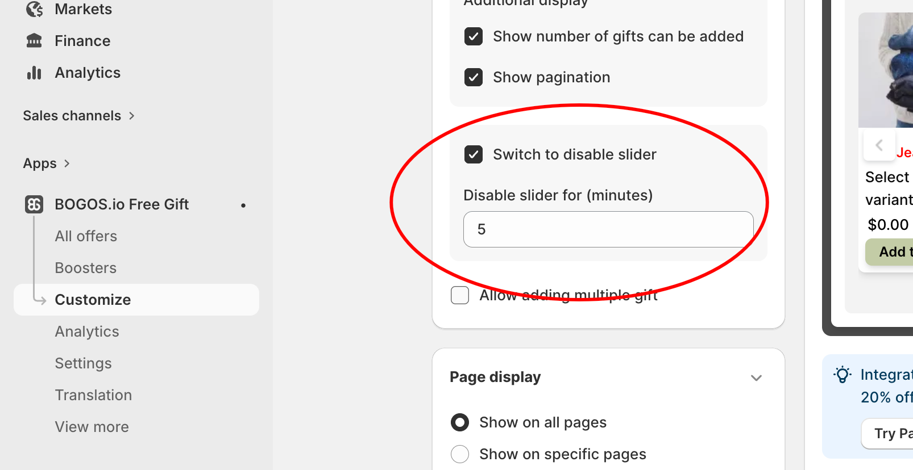

# Geschenkschieberegler anpassen

Die Anpassung des Geschenkschiebereglers hilft Ihnen, Text, Farben, Layout und Produktanzeige Ihres Geschenkschiebereglers anzupassen. Der Schieberegler zeigt alle Geschenkprodukte an, die Kunden erhalten können, und erscheint, wenn Kunden die Bedingungen der Angebote erfüllen.



<figure><figcaption></figcaption></figure>

## 1. Anpassungsoptionen 

### 1.1. Allgemein 

**Geschenkpräsentation:** Die Geschenkpräsentation ermöglicht es Ihnen, zu steuern, wie kostenlose Geschenke Ihren Kunden präsentiert werden. Es gibt zwei Hauptoptionen zur Auswahl.

* Nach Produkten: Geschenke als einzelne Produkte anzeigen, wobei Varianten unter jedem Produkt gruppiert werden.

<figure><figcaption></figcaption></figure>

* Nach Varianten: Jede Variante (z. B. Größe oder Farbe) als separate Geschenkauswahl anzeigen.

<figure><figcaption></figcaption></figure>

**Gruppierung**: Die Gruppierung steuert, wie kostenlose Geschenke organisiert und angezeigt werden, wenn mehrere Angebote aktiv sind.

* Geschenke nach Angeboten anzeigen: Geschenke werden basierend auf dem Angebot, zu dem sie gehören, gruppiert, nützlich, wenn mehrere Aktionen gleichzeitig laufen.

<figure><figcaption></figcaption></figure>

* Alle Geschenke auf einmal anzeigen: Alle berechtigten Geschenke erscheinen in einer einzigen Liste zum schnelleren Durchsuchen.

<figure><figcaption></figcaption></figure>

**Produkte pro Reihe**: Passen Sie an, wie viele Geschenkartikel in einer Reihe erscheinen, um ein übersichtliches Layout zu gewährleisten.

### 1.2. Erweitert 

<figure><figcaption></figcaption></figure>

**Produktpräsentation**: Damit legen Sie fest, wie Geschenkprodukte visuell präsentiert werden, um Kunden eine bessere Interaktion mit dem Geschenkangebot zu ermöglichen.

* Produkttitel anzeigen: Zeigt den Hauptproduktnamen an.
* Variantentitel anzeigen: Zeigt den Variantennamen an (z. B. Größe, Farbe)

**Zusätzliche Anzeige**: Verbessern Sie die Übersichtlichkeit und Benutzerführung mit optionalen Anzeigeerweiterungen.

* Anzahl der hinzufügbaren Geschenke anzeigen: Lässt Kunden sehen, wie viele Geschenkartikel sie im Rahmen des Angebots auswählen können.
* Seitennummerierung anzeigen: Fügt eine Seitennummerierung hinzu, wenn mehrere Geschenkartikel vorhanden sind, um die Anzeige übersichtlich zu halten.

**Schieberegler deaktivieren umschalten**: Mit diesem Kontrollkästchen können Kunden den Schieberegler vorübergehend deaktivieren. Legen Sie die Zeitdauer in Minuten fest.

**Erlauben Sie das Hinzufügen mehrerer Geschenke**: Ermöglicht Kunden, mehr als ein Geschenk auszuwählen.

### 1.3. Seitenanzeige 

<figure><figcaption></figcaption></figure>

**Auf allen Seiten anzeigen**: Zeigt das Angebots-Widget in Ihrem gesamten Shop an.

**Auf bestimmten Seiten anzeigen**: Wählen Sie genau aus, wo das Angebot angezeigt werden soll

* Startseite
* Warenkorbseite
* Produktseite
* Sammlungsseite
* Benutzerdefinierte Seite

### 1.4. Text 

<figure><figcaption></figcaption></figure>

* **Titel des Geschenk-Sliders**: Dies ist die Überschrift, die oben im Fenster des Geschenkschiebereglers erscheint.
* **Schaltfläche „Zum Warenkorb hinzufügen“**: Name der Schaltfläche „Zum Warenkorb hinzufügen“.
* **Slider-Text deaktivieren**: Der Name eines Kontrollkästchens, mit dem Kunden den Geschenkschieberegler deaktivieren können, sodass er einige Minuten lang nicht erneut angezeigt wird.

### 1.5. Farbe  

BOGOS ermöglicht Ihnen, die Farben aller Elemente mit einer der folgenden 4 Methoden anzupassen:

* Wählen Sie ein **vorgefertigtes Farbset** aus dem Dropdown-Menü.
* **Passen Sie jedes Farbfeld manuell an** für alle verfügbaren Farben.
* Verwenden Sie den [KI-Theme-Detektor](customize-gift-slider.md#ai-theme-detector), um automatisch eine vollständige Widget-Farbpalette basierend auf dem Branding Ihres Shops zu generieren.
* **Kontaktieren Sie das BOGOS-Support-Team**, um Hilfe bei der Farbanpassung zu erhalten.

Klicken Sie auf **Speichern**, wenn Sie fertig sind.

#### KI-Theme-Detektor

BOGOS KI scannt Ihren Onlineshop und erkennt die Primär-, Sekundär- und Textfarben Ihrer Marke und generiert dann automatisch eine vollständige Widget-Farbpalette.


Ihr Shop darf NICHT passwortgeschützt sein, damit die KI auf Ihre Markenfarben zugreifen und diese erkennen kann.


So bearbeiten Sie die Farben mit BOGOS KI:

1. Klicken Sie auf das **Stiftsymbol**.

.png>)

2. Klicken Sie auf **Erneut scannen**, damit BOGOS KI erneut erkennt, oder passen Sie **manuell** die Felder Primärfarbe, Sekundärfarbe oder Text an.

.png>)

3. Klicken Sie auf **Anwenden**, um die Farben in der Widget-Vorschau anzuwenden.

### 1.6. Geschenkschieberegler in eine Produktseite einbetten 

<figure><figcaption></figcaption></figure>

Wenn Sie den Geschenkschieberegler nicht als Pop-up verwenden möchten, klicken Sie auf Theme-Editor öffnen, um Ihre bevorzugte Anzeigeoption anzupassen (nur auf Startseite, Sammlung, Produkt und Warenkorbseite verfügbar). &#x20;

* **Schritt 1**: Navigieren Sie im Theme-Editor-Fenster zu dem Block, dem Sie das Geschenkschieberegler-Widget hinzufügen möchten
* **Schritt 2**: Gehen Sie in der linken Seitenleiste zu Apps und klicken Sie auf Block hinzufügen.

<figure><figcaption></figcaption></figure>

* **Schritt 3**: Wenn sich das Fenster öffnet, gehen Sie zu Apps, geben Sie „Gift slider“ in die Suchleiste ein und wählen Sie BOGOS: Gift Slider aus.

<figure><figcaption></figcaption></figure>

* **Schritt 4**: Verschieben Sie den Platzhalter des Geschenkschiebereglers an die gewünschte Position, um Kunden anzuziehen, und klicken Sie dann auf Speichern.

## 2. Den Geschenkschieberegler zu anderen Shop-Seiten hinzufügen

**Schritt 1:** Navigieren Sie im **Shopify-Navigationsmenü** zu Ihren **Onlineshops** => wählen Sie **Themes** => **Anpassen**

**Schritt 2:** Gehen Sie im **Shopify-Theme-Editor** zu der Seite, auf der Sie den Geschenkschieberegler-Block hinzufügen möchten.

Scrollen Sie dann im linken Bereich nach unten, klicken Sie auf **Abschnitt hinzufügen**, wählen Sie **Apps** und suchen und wählen Sie den Block **BOGOS: Gift slider** aus. 

<figure><figcaption></figcaption></figure>

## FAQs

<strong>Gibt es Optionen, die Kunden helfen, Geschenke, Produkte oder Varianten im Geschenkschieberegler schnell zu finden?</strong>

Ja! Bitte kontaktieren Sie unser Support-Team, um die Option „Suche“ im Geschenkschieberegler zu aktivieren. Nach der Aktivierung können Kunden problemlos nach Produkt- oder Variantennamen suchen.

.png>)

<strong>Ist es möglich, das Geschenk-Pop-up im Warenkorb-Drawer anzuzeigen?</strong>

Derzeit können wir unser Geschenk-Pop-up nur in kompatiblen Warenkorb-Drawern hinzufügen. Wenn Sie diese Anfrage stellen möchten, kontaktieren Sie uns bitte über den Live-Chat, unser technisches Team wird zunächst Ihren Warenkorb prüfen und dann daran arbeiten.

<strong>Ich möchte steuern, wie oft das Geschenk-Pop-up erscheint, ist das möglich?</strong>

Ja, Sie können dies teilweise mit der integrierten Option „Slider deaktivieren“ steuern:

Hier sind die Schritte, um diese Funktion zu aktivieren:&#x20;

* Gehen Sie zu BOGOS → Anpassen → Geschenkschieberegler.
* Aktivieren Sie in den erweiterten Einstellungen „Schieberegler deaktivieren umschalten“.
* Legen Sie die Zeitdauer (Minuten) fest – während dieser Zeit erscheint das Pop-up nicht erneut, wenn der Kunde diesen Schalter aktiviert.

<strong>Kann ich ausverkaufte Produkte automatisch aus der Geschenkauswahl ausblenden/deaktivieren?</strong>

Mit der **Klon-Geschenk-Logik**, ja, aber nicht durch „Ausblenden“ innerhalb der Slider-Einstellungen; Sie steuern es über das Lagerverhalten:

Checkliste:

* Wählen Sie unter BOGOS → Einstellungen → Geschenk-Lagerverwaltung „Menge der Geschenkprodukte mit der Menge der Originalprodukte synchronisieren“.
* Wählen Sie für „Wenn das Geschenk nicht vorrätig ist“ die Option „Angebote stoppen“ (nicht „Weiterverkaufen“).
* Stellen Sie sicher, dass das Originalprodukt (oder das geklonte Geschenkprodukt, wenn Sie manuelles Inventar verwenden) den korrekten Lagerbestand in Shopify hat.

Mit aktivierter Option „Angebote stoppen“ wird das Angebot gestoppt, sobald ein Geschenk nicht mehr vorrätig ist, sodass das ausverkaufte Geschenk nicht mehr zur Auswahl steht.&#x20;

Mit der **Geschenkfunktions-Logik** wird das ausverkaufte Geschenk automatisch im Geschenkschieberegler ausgeblendet, sodass Sie nichts weiter tun müssen.

Wenn Sie ein granulareres Ausblenden pro Variante innerhalb eines Angebots benötigen, kontaktieren Sie den BOGOS-Support über den Live-Chat für eine individuelle Überprüfung.

<strong>Wie ändere ich die Reihenfolge der Geschenkartikel im Geschenk-Pop-up?</strong>

Um die Reihenfolge der Geschenkartikel im Geschenk-Pop-up zu ändern, folgen Sie bitte diesen Schritten:&#x20;

1. Gehen Sie zum Angebot, das Sie erstellt haben > gehen Sie zu Geschenkauswahl
2. Klicken Sie auf das erste Symbol vor dem Titel des Geschenkprodukts, wie in meinem Screenshot dargestellt, um die Produktreihenfolge zu ändern

