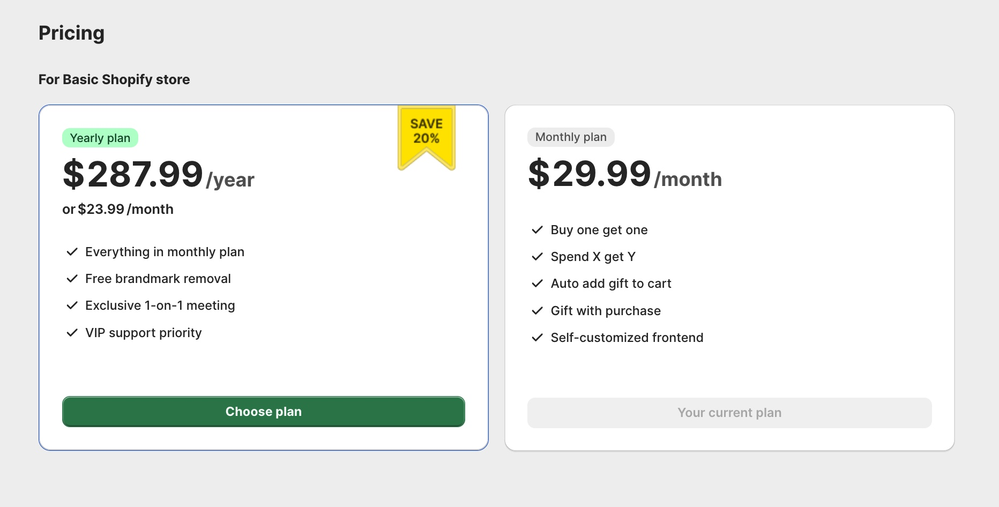

# 4. Welchen BOGOS-Plan habe ich?

Ihr BOGOS-Preisplan hängt von Ihrem Shopify-Plan ab.

<figure><figcaption></figcaption></figure>

Sie können Ihren aktuellen Preisplan auch in der BOGOS-App unter Abrechnungen und Pläne überprüfen.

<figure><figcaption></figcaption></figure>

Den vollständigen Preisplan und die Leistungspakete finden Sie [hier](https://bogos.io/pricing/).
