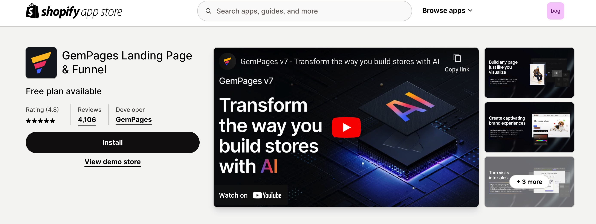

# GemPages

GemPages ist ein leistungsstarker, conversion-orientierter Page Builder, der Ihre Shopify-Shops verbessert. Mit über 80 conversion-optimierten Vorlagen und KI-gestützter Layout-Generierung aus Bildern oder URLs bietet GemPages eine mühelose Möglichkeit, einen einzigartigen, markengerechten Online-Shop zu gestalten.

**Hauptfunktionen von GemPages:**

* Alle Seitentypen: Startseite, Produkt, Kollektion, FAQ, Blogbeiträge und Landingpages
* Beeindruckende, mobilfreundliche Vorlagen, die mit den neuesten Shopify-Themes funktionieren
* Integrierte Verkaufsbooster: Countdown, Bestandszähler, Bundles, Vorher & Nachher
* Minimierter Aufwand beim Erstellen: Verwandeln Sie Bilder/URLs in Sekunden mit KI in Layouts
* Erhöhte Produktivität: Globaler Stil, Produktzuordnung, Theme-Abschnitte und mehr


Die Integration zwischen BOGOS und GemPages ermöglicht die dynamische Platzierung und Anpassung von Angeboten.




## So installieren Sie GemPages

**Schritt 1:** Installieren Sie GemPages aus dem [Shopify App Store](https://gempages.net/?ref=xwcvw2rs).

<figure><figcaption></figcaption></figure>

**Schritt 2:** Erstellen Sie eine neue Seite mit dieser [Anleitung von GemPages](https://help.gempages.net/articles/create-new-page).

**Schritt 3:** Öffnen Sie den GemPages-Editor und suchen Sie nach dem App-Element. Ziehen Sie das Element per Drag & Drop in den Gestaltungsbereich.

<figure><figcaption></figcaption></figure>

**Schritt 4:** Innerhalb jedes Elements finden Sie vier Widget-Optionen:

* [Geschenksymbol](../../detailed-guide/customize/customize-gift-icon-and-gift-thumbnail.md)
* [Miniaturansicht des Geschenks](../../detailed-guide/customize/customize-gift-icon-and-gift-thumbnail.md)
* [Geschenkschieberegler](../../detailed-guide/customize/customize-gift-slider.md)
* [Warenkorbnachricht](../../detailed-guide/customize/customize-cart-message.md)
* [Mengenpause](../../detailed-guide/discount-offer/create-quantity-break.md)
* [Klassisches Paket](../../detailed-guide/bundle-offer/create-classic-bundle.md)
* [Mischen und kombinieren](../../detailed-guide/bundle-offer/create-mix-and-match-bundle.md)

Wählen Sie die Widgets aus, die Ihren Anforderungen entsprechen. Sobald Sie ausgewählt haben, wird Ihre Seite automatisch aktualisiert, um das neue Layout widerzuspiegeln, genau wie im folgenden Beispiel.

<figure><figcaption>
Vorher: Standard-Geschenkschieberegler
</figcaption></figure>

<figure><figcaption>
Nachher: Geschenkschieberegler-Widget auf neuer Seite
</figcaption></figure>
