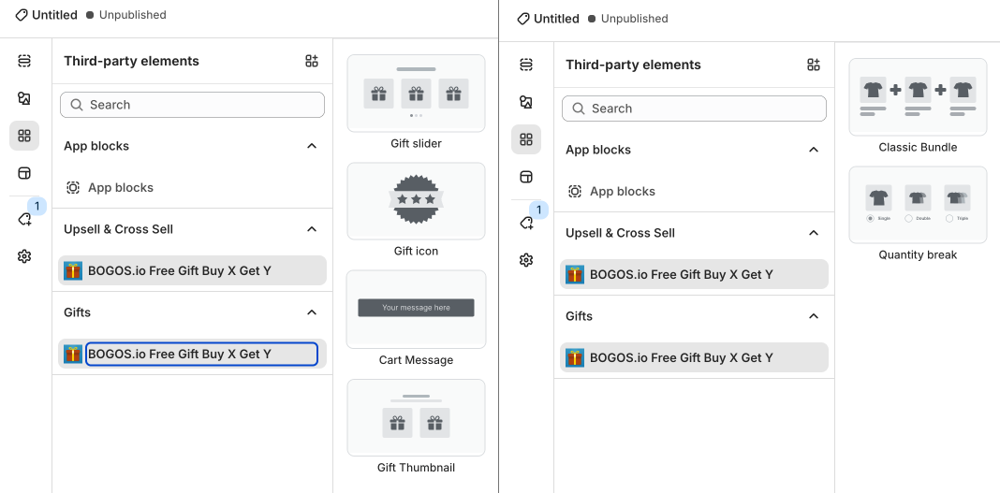

# PageFly

PageFly ist ein benutzerfreundlicher Page Builder, der perfekt für jeden geeignet ist – von neuen Shopify-Store-Betreibern über wachsende Unternehmen bis hin zu professionellen Marken. Sie können Ihre Shopify-Seiten ohne jegliche Programmierkenntnisse anpassen, um Besucher in tatsächliche Kunden zu verwandeln.&#x20;

Wichtige Funktionen von PageFly:

* 6 Hauptseitentypen mit über 100 Seitenvorlagen, über 100 vorgefertigten Abschnitten und mehr
* Optimiert für die Konversionsrate mit Countdown, Verkaufsbanner, Cross-Selling, Farbmustern
* Als SEO-freundliches Tool zertifiziert – sagen Sie Nein zu einem langsamen Online-Store
* Vollständig responsives Design für Desktop, Mobilgeräte oder Tablet.
* Kompatibel mit jedem Theme, fügen Sie ganz einfach weitere Abschnitte zu Themes hinzu


Die Integration zwischen BOGOS und PageFly ermöglicht die dynamische Platzierung und Anpassung von Angeboten und Bundles.




## So installieren Sie PageFly

**Schritt 1:** Installieren Sie PageFly aus dem [Shopify App Store](https://shopify.pxf.io/zNEOG7).

<figure><figcaption></figcaption></figure>

**Schritt 2:** Erstellen Sie Ihre PageFly-Seite: [eine neue Seite](https://help.pagefly.io/manual/get-started-in-5-mins/), oder verwenden Sie [deren Vorlagen](https://help.pagefly.io/manual/use-a-template-to-create-a-new-page/)

**Schritt 3:** Suchen Sie unter Drittanbieter-Integrationen nach BOGOS und aktivieren Sie die App-Integrationen. Stellen Sie bitte sicher, dass die BOGOS-App in Ihrem Shopify-Store installiert ist. Sie sollten außerdem ein BOGOS-Angebot oder -Bundle erstellen, bevor Sie diese in PageFly einrichten.

<figure><figcaption></figcaption></figure>

**Schritt 4:** Wählen Sie Ihre bevorzugten App-Blöcke. Es gibt zwei Arten von BOGOS-App-Blöcken:

* Geschenke: Enthält [Gift Slider](../../detailed-guide/gift-offer/), [Gift Icon](../../detailed-guide/customize/customize-gift-icon-and-gift-thumbnail.md), [Cart Message](../../detailed-guide/customize/customize-cart-message.md) und Gift Thumbnail
* Upsell & Cross-Sell: Enthält [Classic Bundle](../../detailed-guide/bundle-offer/create-classic-bundle.md) und [Quantity Break](../../detailed-guide/discount-offer/create-quantity-break.md). Diese Blöcke funktionieren nur auf der Produktseite.

<figure><figcaption></figcaption></figure>

**Schritt 5:** Ziehen Sie die BOGOS-Blöcke per Drag-and-Drop auf Ihre Seite. Klicken Sie anschließend bitte auf _Speichern_ und _Veröffentlichen_, damit die Änderungen automatisch in Ihrem Online-Store übernommen werden.

<figure><figcaption></figcaption></figure>
