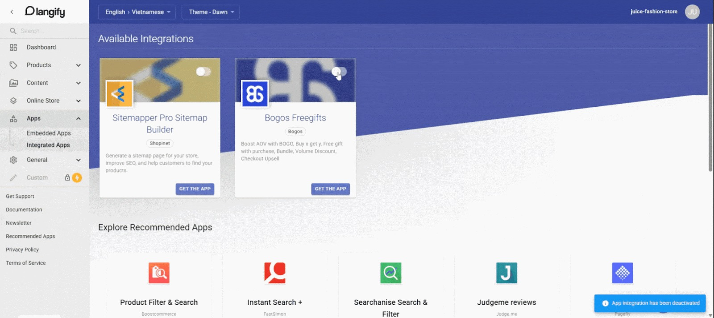

# Langify

[Langify](https://apps.shopify.com/langify?utm_source=gitbook\&utm_medium=integration\&utm_campaign=BOGOS) ist eine führende, einfach zu bedienende Übersetzungs-App, die Shopify-Händlern dabei hilft, internationale Zielgruppen zu erreichen, indem Store-Inhalte in mehrere Sprachen übersetzt werden – ohne mehrere Stores oder komplexe Einrichtungen zu benötigen.

**Wichtige Funktionen von Langify:**

* KI- und manuelle Übersetzungen – Kombiniert die Leistungsfähigkeit der KI-Automatisierung mit präziser manueller Kontrolle, um genaue, hochwertige Übersetzungen sicherzustellen.
* Exklusiver Switcher-Konfigurator – Passen Sie Ihren Sprachumschalter perfekt an das Design und Branding Ihres Stores an.
* Übersetzung von Drittanbieter-Apps – Übersetzen Sie Inhalte aus anderen Apps nahtlos und sorgen Sie so für ein vollständig lokalisiertes Einkaufserlebnis.
* SEO-Optimierung – Steigern Sie Ihre internationale Sichtbarkeit mit SEO-freundlichen Unterordnern und benutzerdefinierten Domain-Optionen.

## So integrieren Sie BOGOS mit Langify

**Schritt 1:** **Installieren Sie BOGOS** aus dem [Shopify App Store](https://apps.shopify.com/freegifts?utm_source=gitbook\&utm_medium=integration\&utm_campaign=Langify) und richten Sie Angebote ein

**Schritt 2:** **Aktivieren Sie die Langify**-Integration in BOGOS

In der BOGOS-App > Gehen Sie zu Übersetzung > Aktivieren Sie Per Drittanbieter-Integration > Klicken Sie auf Langify verbinden

<figure><figcaption></figcaption></figure>

**Schritt 3:** **Installieren Sie Langify** aus dem [Shopify App Store](https://apps.shopify.com/langify?utm_source=gitbook\&utm_medium=integration\&utm_campaign=BOGOS)

**Schritt 4: Aktivieren Sie die BOGOS**-Integration in Langify

In der Langify-App > Gehen Sie zu Apps > Integrierte Apps > Aktivieren Sie den Schalter der BOGOS-App

<figure><figcaption></figcaption></figure>

**Schritt 5:** Richten Sie die Sprache in der Langify-App [hier](https://support.langify-app.com/support/solutions/articles/11000081178-first-steps) ein

**Schritt 6:** Übersetzen Sie BOGOS-Widgets&#x20;

In der Langify-App > Gehen Sie zu Apps > Integrierte Apps > Bogos Freegifts

<figure><figcaption></figcaption></figure>

Klicken Sie auf das Widget, das Sie übersetzen möchten > Übersetzen

<figure><figcaption></figcaption></figure>

_Hinweis: Sie können die Option Maschinelle Übersetzung verwenden, um automatisch zu übersetzen, oder Ihre eigene Übersetzung manuell in das Feld eingeben._

<figure><figcaption></figcaption></figure>

 
